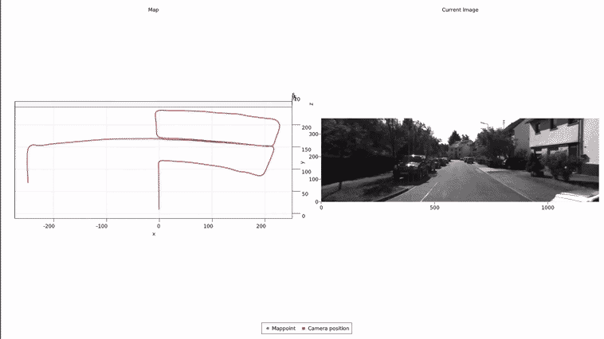

# SLAM.jl

[](https://pxl-th.github.io/SLAM.jl/dev/)

Simultaneous Localization and Mapping.

[[Video 1]](https://youtu.be/XLFdwK0FIYI)



## Install

```bash
]add https://github.com/pxl-th/RecoverPose.jl.git
]add https://github.com/pxl-th/ImageTracking.jl.git
]add https://github.com/pxl-th/SLAM.jl.git
```

[RecoverPose.jl](https://github.com/pxl-th/RecoverPose.jl) contains functions for computing poses and triangulation methods.
Fork of [ImageTracking.jl](https://github.com/pxl-th/ImageTracking.jl) contains certain memory improvements
and has no restriction on the magnitude of the optical flow.

## Usage

See [docs](https://pxl-th.github.io/SLAM.jl/dev/) for instructions
or [example/kitty/main.jl](https://github.com/pxl-th/SLAM.jl/tree/master/example/kitty/main.jl)
for a full example on how to use.
