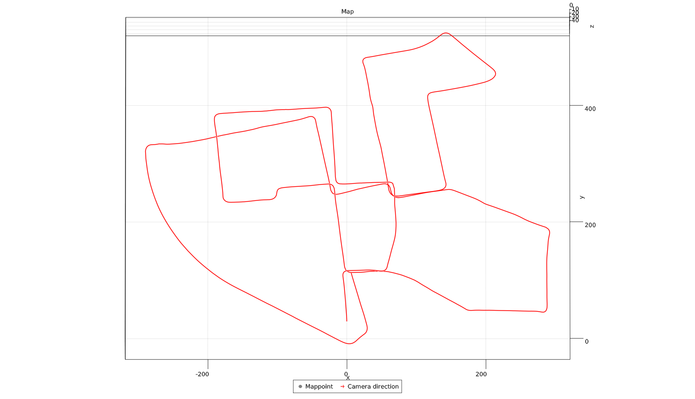

# SLAM.jl

Simultaneous Localization and Mapping.

## Features

- Monocular / Stereo modes.
- Bundle-Adjustment over a subset of Keyframes.
- Local Map Matching for re-tracking lost Mappoints back into Frame.

## Install

```julia
]add https://github.com/pxl-th/SLAM.jl.git
```

## Usage

Minimal abstract example of how to use.

```julia
using SLAM

camera = Camera(...)
params = Params(; stereo=false, ...)
manager = SlamManager(camera, params)
manager_thread = Threads.@spawn run!(manager)

images = Matrix{Gray{Float64}}[...]
timestamps = Float64[...]

for (time, image) in zip(timestamps, images)
    add_image!(manager, image, timestamp)
    sleep(1e-2)
end

manager.exit_required = true
wait(manager_thread)
```

For a more detailed explanation, see [Tutorial](@ref) section.
If you prefer looking at raw code instead, look at a complete KITTY Dataset
[example](https://github.com/pxl-th/SLAM.jl/tree/master/example/kitty).

To launch the example, download KITTY Dataset,
change `base_dir` and `save_dir` to you own (`base_dir` should be the root
directory of KITTY dataset folder) and launch in from the REPL:

```julia
include("./example/kitty/main.jl")

# Launch SLAM
n_frames = 100
slam_manager, visualizer = main(n_frames)

# Replay saved result
replay(n_frames)
```

!!! warning

    These are 3 components in the SLAM.jl that need to run on a separate
    thread. So, remember to launch Julia with at least `-t4` flag
    (+ 1 for the main thread).

## Results

Final map on the `00` sequence taken from KITTY dataset in stereo mode.


